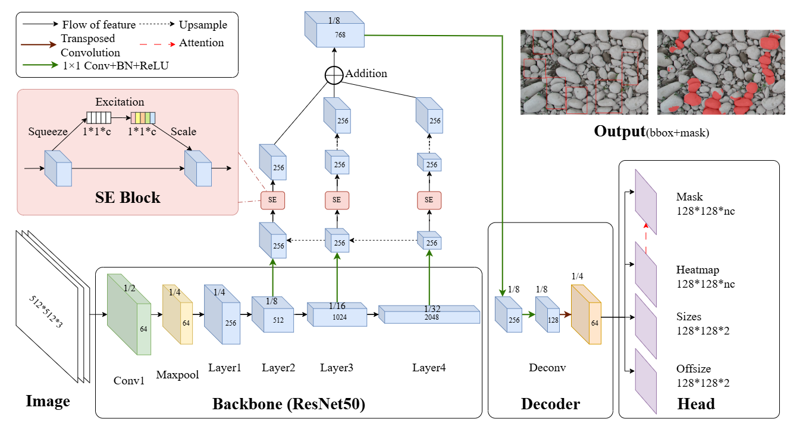
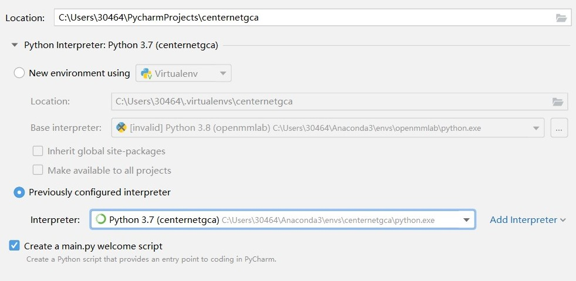
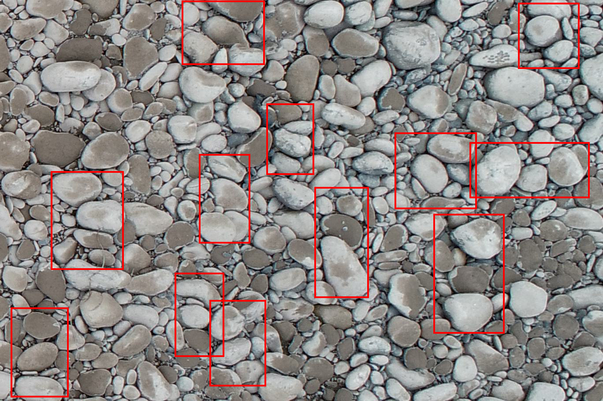
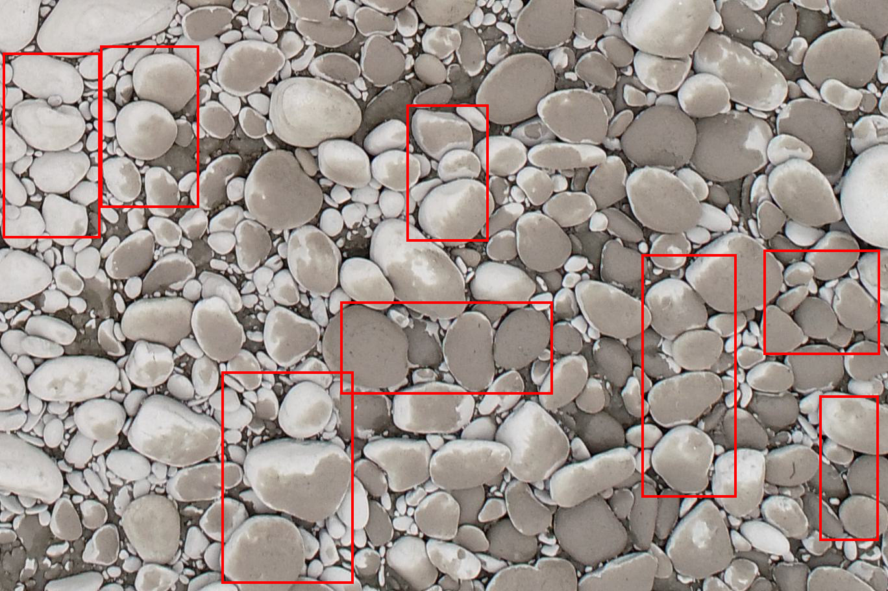

#   CenterNet-GCA:CenterNet for Gravel Clusters Analysis

##   Environment
torch==1.13.0
##   Trained Weights
The pre-trained weights UD00.pth, UD00H1.pth, and UDH00.pth, trained on natural pebble and Hassan laboratory pebble datasets, can be downloaded from Baidu Netdisk.
-  link: https://pan.baidu.com/s/1rMWSSVxKAHcL5FRsB2YDtg
-  Extraction code: 8x95
##   Instructions
###  1.Setting up the environment using Anaconda    
Open the Anaconda Prompt and enter the following commands to create a new environment named centernetgca, install Python 3.7, and set up some basic dependencies.  
```Python
conda create --name centernetgca python=3.7
```
Enter the following command in the Anaconda Prompt to activate the newly created environment.  
```Python
conda activate centernetgca
```
Save the requirements.txt file locally, for example on the desktop, and enter the following command to navigate to the directory where the file is located (replace it with the actual path).    
```Python
cd C:\Users\name\Desktop
```
Then run the following command to install all required dependencies except torch. 
```Python
pip install -r requirements.txt
```
When installing torch, you need to choose the installation command that matches your GPU. You can find the appropriate command on the PyTorch website under Get Started → Previous PyTorch Versions.
The installation command used in this guide is as follows:
```Python
pip install torch==1.13.0+cu116 torchvision==0.14.0+cu116 --index-url https://download.pytorch.org/whl/cu116
```
-  If you don't have Anaconda, please download it first. Official website link: https://www.anaconda.com
###  2.Create python project named centernetgca  
Create a new project named centernetgca in PyCharm, select Previously configured Interpreter, and choose the python.exe file located in the target environment folder inside the envs directory of your Anaconda installation.  

-  If you don't have PyCharm, please download it first from the official website: https://www.jetbrains.com/pycharm/  
###  3.Using CenterNet-GCA to detect pebbles in images   
1.  Download the code and save it in the project directory.    
2.  Download the weights into the model_data folder, and specify their path in the model_path parameter inside the newmask_CenterNet.py file.    
3.  Modify the mode parameter in the newmask_predict.py file as needed. If dir_predict mode is selected, also update the dir_origin_path and dir_save_path parameters.  
4.  You may fine-tune the confidence parameter in newmask_CenterNet.py based on detection performance. It is recommended to start adjusting from 0.2.  
##   Attention
1.  Improvements were made only for the case where the backbone network is ResNet50; in the code, all backbone parameters support only resnet50.
2.  When detecting large-size images, they should first be cropped into smaller images (preferably no larger than 1500×1000) before being processed by CenterNet-GCA.
##   Example
The following detection results were obtained using the UD00 weights.


##   Reference
-  https://github.com/bubbliiiing/centernet-pytorch
-  https://github.com/xingyizhou/CenterNet

##   所需环境
torch==1.13.0
##   权重下载
已在天然卵石和Hassan实验室卵石数据集上训练好的权重UD00.pth、UD00H1.pth和UDH00.pth可在百度网盘中下载。
-  链接: https://pan.baidu.com/s/1rMWSSVxKAHcL5FRsB2YDtg
-  提取码: 8x95
##   使用说明
###  1.使用Anaconda配置环境  
打开Anaconda Prompt，输入以下代码，创建一个名为centernetgca的新环境、安装Python 3.7及部分基础依赖  
```Python
conda create --name centernetgca python=3.7
```
在Anaconda Prompt输入如下指令进入新创建好的环境  
```Python
conda activate centernetgca
```
保存requirements.txt文件到本地，如保存在桌面，输入以下代码进入文件所在路径（需修改为真实路径）  
```Python
cd C:\Users\name\Desktop
```
再运行下面的指令即可安装除torch外需要的依赖包
```Python
pip install -r requirements.txt
``` 
安装torch时需要根据显卡条件，在pytorch官网-Get Started-Previous PyTorch Versions获取对应的安装命令，本文使用的安装命令如下：
```Python
pip install torch==1.13.0+cu116 torchvision==0.14.0+cu116 --index-url https://download.pytorch.org/whl/cu116
```
-  若无Anaconda，请先下载，官网链接https://www.anaconda.com
###  2.新建python项目
在PyCharm中新建项目centernetgca，选择Previously confugured Interpreter，并且在Anaconda目录中的env文件夹下目标环境文件夹中选中python.exe文件。  

-  若无PyCharm，请先下载，官网链接https://www.jetbrains.com/pycharm/  
###  3.使用CenterNet-GCA对卵石图片进行检测  
1.  下载代码并保存在项目所在目录。  
2.  下载权重存放在model_data文件夹，并将其存放地址写入newmask_CenterNet.py文件中的model_path参数。  
3.  根据需要，修改newmask_predict.py文件中的mode参数。若选择dir_predict模式，还需修改dir_origin_path、dir_save_path参数。 
4.  可根据检测效果微调newmask_CenterNet.py文件中的confidence参数，建议从0.2开始调整。
##   注意事项
1.  仅对主干网络为ResNet50的情况进行了相应改进，代码中所有的backbone参数只支持resnet50。 
2.  检测大尺寸图片时需要先裁剪为小尺寸图片（最好不超过1500*1000），再使用CenterNet-GCA识别。
##   检测示例
以下检测结果为使用权重UD00得到


##   参考
-  https://github.com/bubbliiiing/centernet-pytorch
-  https://github.com/xingyizhou/CenterNet
